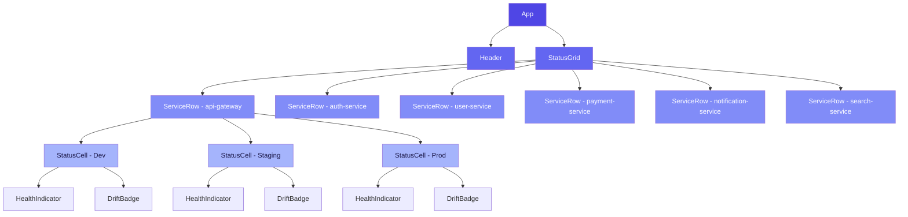
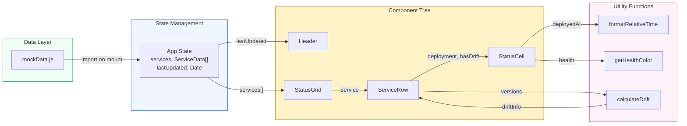

# Design Document: Environment Status Dashboard

**Version:** 1.0
**Date:** 2026-02-27
**Status:** Design Phase Complete

---

## Executive Summary

The Environment Status Dashboard is a single-page React application that provides engineering teams with a unified, real-time view of deployment status across all services and environments. It replaces fragmented information sources (Slack, wikis, tribal knowledge) with a scannable grid displaying health status, version numbers, deployment timestamps, and version drift warnings for six core microservices across Development, Staging, and Production environments.

The application uses React 18 with Tailwind CSS for styling, Lucide React for accessible iconography, and a mock data layer designed for trivial swap to real API integration. The architecture prioritizes information density, scannability, and WCAG AA accessibility compliance.

---

## Component Hierarchy



### Component Responsibilities

| Component | Role | Key Props |
|-----------|------|-----------|
| **App** | Application shell, state management, data provider | — |
| **Header** | Title, last-updated timestamp, refresh button | `lastUpdated: Date` |
| **StatusGrid** | Grid layout, column headers, service iteration | `services: ServiceData[]` |
| **ServiceRow** | Row container, drift calculation per service | `service: ServiceData` |
| **StatusCell** | Individual environment deployment display | `deployment: DeploymentData, hasDrift: boolean` |
| **HealthIndicator** | Color dot + accessible icon for health status | `status: HealthStatus` |
| **DriftBadge** | Conditional warning badge for version drift | `versionsAhead: number` |

---

## Data Flow Diagram



### Data Flow Summary

1. **Mount:** `App` imports mock data from `mockData.js` into component state
2. **Distribution:** `App` passes `services[]` to `StatusGrid` and `lastUpdated` to `Header`
3. **Row Processing:** `StatusGrid` iterates services, passing each `ServiceData` to a `ServiceRow`
4. **Drift Calculation:** `ServiceRow` calls `calculateDrift()` with dev/staging/prod versions, producing drift flags
5. **Cell Rendering:** `StatusCell` receives `DeploymentData` + drift flag, uses `formatRelativeTime()` and `getHealthColor()` for display
6. **Refresh:** Refresh button in `Header` triggers re-import of mock data, updating `App` state

---

## Wireframe Descriptions

### Main Dashboard View (1280px+)

```
┌──────────────────────────────────────────────────────────────────────────┐
│  ┌────────────────────────────────────────────────────────────────────┐  │
│  │  🔲 Coder Environment Status Dashboard          Updated 2 min ago │  │
│  │                                               [ 🔄 Refresh ]      │  │
│  └────────────────────────────────────────────────────────────────────┘  │
│                                                                          │
│  ┌────────────────────────────────────────────────────────────────────┐  │
│  │ Service               │ Development    │ Staging       │ Production│  │
│  ├───────────────────────┼────────────────┼───────────────┼──────────┤  │
│  │ API Gateway           │ ● v2.8.0      │ ● v2.7.1     │ ● v2.6.0 │  │
│  │ Main API routing      │ 30 min ago    │ 1 day ago    │ 3 days ago│  │
│  │                       │ sarah.chen    │ mike.johnson │ sarah.chen│  │
│  ├───────────────────────┼────────────────┼───────────────┼──────────┤  │
│  │ Auth Service           │ ● v3.2.1      │ ⚠ v3.2.0     │ ● v3.1.0 │  │
│  │ Authentication         │ 2 hours ago   │ 2 days ago   │ 7 days ago│  │
│  │                        │ alex.kumar    │ alex.kumar   │ jordan.lee│  │
│  ├───────────────────────┼────────────────┼───────────────┼──────────┤  │
│  │ Payment Service        │ ● v4.1.0      │ ● v4.0.2     │ ✖ v3.9.1 │  │
│  │ Payment processing     │ 4 hours ago   │ 3 days ago   │ 10 days  │  │
│  │                        │ david.park    │ david.park   │ ⚠ DRIFT  │  │
│  ├───────────────────────┼────────────────┼───────────────┼──────────┤  │
│  │ ...remaining services  │               │              │          │  │
│  └───────────────────────┴────────────────┴───────────────┴──────────┘  │
└──────────────────────────────────────────────────────────────────────────┘
```

### Status Cell Detail

Each cell in the grid contains four vertically-stacked pieces of information:

```
┌─────────────────────────┐
│ ● Healthy   v2.8.0      │  ← Row 1: Health icon + dot + version (bold)
│ 30 minutes ago           │  ← Row 2: Relative timestamp (muted text)
│ by sarah.chen            │  ← Row 3: Deployer attribution (small text)
│ ⚠ 3 versions behind     │  ← Row 4: Drift badge (conditional, orange)
└─────────────────────────┘
```

**Visual states by health:**
- **Healthy:** Subtle green background tint (`bg-green-50`), green dot, checkmark icon
- **Degraded:** Subtle yellow background tint (`bg-yellow-50`), yellow dot, alert-triangle icon
- **Down:** Subtle red background tint (`bg-red-50`), red dot, x-circle icon

### Header Bar

```
┌────────────────────────────────────────────────────────────────────┐
│  [Server Icon] Coder Environment Status Dashboard                  │
│                                            Last updated: 2 min ago │
│                                                    [ 🔄 Refresh ]  │
└────────────────────────────────────────────────────────────────────┘
```

- Full-width, fixed at top of viewport
- Title left-aligned, timestamp and refresh button right-aligned
- Background: white with subtle bottom border (`border-b border-gray-200`)

---

## Technical Decisions

### 1. React 18 with Vite (Build Tool)

**Decision:** Use Vite as the build tool and dev server.

**Justification:**
- Near-instant HMR for rapid development iteration
- Lightweight compared to Create React App or Next.js (no SSR needed for a dashboard)
- Native ES module support aligns with modern browser targets
- Minimal configuration required

**Trade-offs considered:**
- Next.js: Too heavy — SSR/SSG unnecessary for a mock-data SPA
- Parcel: Less ecosystem support than Vite
- esbuild directly: Requires more manual configuration

### 2. Tailwind CSS (Utility-First Styling)

**Decision:** Use Tailwind CSS utility classes exclusively — no custom CSS files.

**Justification:**
- Consistent design system out of the box (spacing, colors, typography)
- Color palette for health status maps directly to Tailwind's color scale
- Responsive utilities built-in for 1280px+ requirement
- Eliminates CSS naming/scoping issues in component-based architecture

**Trade-offs considered:**
- CSS Modules: More isolation but more boilerplate for a small app
- Styled Components: Runtime overhead unnecessary for this use case

### 3. Lucide React (Iconography)

**Decision:** Use Lucide React for all icons.

**Justification:**
- Tree-shakeable — only imports icons actually used
- Consistent, clean icon style that pairs well with Tailwind
- Provides accessibility-critical icons: `CheckCircle`, `AlertTriangle`, `XCircle`, `RefreshCw`
- MIT licensed, actively maintained

### 4. Mock Data Architecture

**Decision:** Centralized mock data module (`data/mockData.js`) with the same shape as the planned API response.

**Justification:**
- Single file to replace when connecting to real API
- Enables development without backend dependency
- Data scenarios cover all visual states (healthy, degraded, down, drift)

### 5. State Management: Local React State (useState)

**Decision:** Use React `useState` in the `App` component — no external state management library.

**Justification:**
- Only two pieces of state: `services[]` and `lastUpdated`
- No complex state interactions or cross-component mutations
- Adding Redux/Zustand/Jotai would be premature abstraction for this scope

### 6. React.memo for StatusCell Optimization

**Decision:** Wrap `StatusCell` in `React.memo` to prevent unnecessary re-renders.

**Justification:**
- 6 services × 3 environments = 18 StatusCells rendered
- On refresh, only cells with changed data should re-render
- Lightweight optimization with measurable benefit

---

## Implementation Considerations

### File Structure

```
src/
├── App.jsx                    # Root component: state, layout shell
├── components/
│   ├── Header.jsx             # Title, timestamp, refresh button
│   ├── StatusGrid.jsx         # Grid layout with column headers
│   ├── ServiceRow.jsx         # Per-service row with drift calculation
│   ├── StatusCell.jsx         # Individual environment cell (memo'd)
│   ├── HealthIndicator.jsx    # Health dot + accessible icon
│   └── DriftBadge.jsx         # Conditional version drift warning
├── data/
│   └── mockData.js            # Mock service deployment data
├── utils/
│   ├── formatRelativeTime.js  # Date → "X minutes ago"
│   ├── calculateDrift.js      # Semver comparison + drift thresholds
│   └── healthColors.js        # Status → Tailwind class mapping
└── index.jsx                  # Entry point, renders <App />
```

### Version Parsing Strategy

Support two version formats:
- **Semantic version** (`v2.4.1`): Parse with regex `/v?(\d+)\.(\d+)\.(\d+)/`, compare using `(major * 100 + minor)` for drift
- **Commit SHA** (`a3f2c1b`): Cannot calculate drift — skip drift badge, display as-is
- **Beta versions** (`v5.0.0-beta`): Strip suffix for version comparison, display full string

### Drift Threshold Rules

| Comparison | Threshold | Warning Triggered |
|------------|-----------|-------------------|
| Dev → Staging | > 2 minor versions behind | Yes |
| Staging → Production | > 1 minor version behind | Yes |

Drift is calculated in `ServiceRow` and passed as a boolean `hasDrift` prop to the relevant `StatusCell`.

### Refresh Behavior

- Refresh button in `Header` calls a callback that re-imports mock data
- `lastUpdated` timestamp updates on each refresh
- No auto-refresh polling in v1 (out of scope)

### Error States

Since v1 uses mock data, no network error states are required. The data structure is designed so that adding error handling later (loading, error, empty states) requires only adding conditional rendering in `App`.

---

## Accessibility Requirements (WCAG AA)

### Color Independence (1.4.1 Use of Color)

All health statuses use **both** color and iconography:

| Status | Color | Icon | Screen Reader Text |
|--------|-------|------|--------------------|
| Healthy | Green (`#16a34a`) | `CheckCircle` (Lucide) | "Healthy" |
| Degraded | Yellow (`#ca8a04`) | `AlertTriangle` (Lucide) | "Degraded" |
| Down | Red (`#dc2626`) | `XCircle` (Lucide) | "Down" |

This ensures colorblind users can distinguish statuses via icon shape alone.

### Contrast Ratios (1.4.3 Minimum Contrast)

All text must meet **4.5:1** contrast ratio against its background:

| Element | Foreground | Background | Ratio |
|---------|-----------|------------|-------|
| Primary text (version) | `text-gray-900` (#111827) | White (#ffffff) | 17.4:1 |
| Secondary text (timestamp) | `text-gray-600` (#4B5563) | White (#ffffff) | 7.1:1 |
| Tertiary text (deployer) | `text-gray-500` (#6B7280) | White (#ffffff) | 5.7:1 |
| Healthy status text | `text-green-700` (#15803d) | `bg-green-50` (#f0fdf4) | 5.1:1 |
| Degraded status text | `text-yellow-700` (#a16207) | `bg-yellow-50` (#fefce8) | 5.2:1 |
| Down status text | `text-red-700` (#b91c1c) | `bg-red-50` (#fef2f2) | 5.8:1 |
| Drift warning text | `text-orange-800` (#9a3412) | `bg-orange-100` (#ffedd5) | 5.4:1 |

### Keyboard Navigation (2.1.1 Keyboard)

- Refresh button is focusable and activatable via Enter/Space
- Tab order follows visual layout: Header → Grid (left to right, top to bottom)
- Focus indicators use Tailwind's `focus:ring-2 focus:ring-offset-2 focus:ring-indigo-500`

### Semantic HTML (1.3.1 Info and Relationships)

- Grid uses `<table>` with proper `<thead>`, `<th scope="col">`, and `<th scope="row">` for service names
- Health icons include `aria-label` attributes
- Drift badges include `role="status"` and descriptive `aria-label`
- Last-updated timestamp uses `<time>` element with `datetime` attribute

### Screen Reader Considerations

- Each `StatusCell` provides a complete `aria-label` summarizing all four data points:
  `"API Gateway in Development: version 2.8.0, healthy, deployed 30 minutes ago by sarah.chen"`
- Drift warnings are announced: `"Warning: 3 minor versions behind"`
- Refresh button: `aria-label="Refresh deployment data"`

---

## Visual Design Tokens

### Spacing

| Token | Value | Usage |
|-------|-------|-------|
| Grid gap | `gap-4` (16px) | Between cells |
| Cell padding | `p-4` (16px) | Internal cell padding |
| Header padding | `px-6 py-4` | Header bar padding |
| Section margin | `mt-6` (24px) | Between header and grid |

### Typography

| Element | Classes | Size |
|---------|---------|------|
| Dashboard title | `text-2xl font-bold text-gray-900` | 24px |
| Column headers | `text-sm font-semibold text-gray-600 uppercase tracking-wide` | 14px |
| Service name | `text-base font-medium text-gray-900` | 16px |
| Version number | `text-sm font-semibold` | 14px |
| Timestamp | `text-xs text-gray-500` | 12px |
| Deployer | `text-xs text-gray-400` | 12px |

### Interaction States

| State | Treatment |
|-------|-----------|
| Cell hover | `hover:shadow-md transition-shadow duration-150` |
| Cell default | `border border-gray-200 rounded-lg` |
| Refresh button hover | `hover:bg-gray-100 rounded-md` |
| Focus visible | `focus-visible:ring-2 focus-visible:ring-indigo-500 focus-visible:ring-offset-2` |

---

## Summary of Key Design Decisions

1. **Table-based grid** for semantic correctness and accessibility over CSS Grid
2. **No external state management** — React useState is sufficient for this scope
3. **Vite over Next.js** — lighter weight, no SSR needed
4. **Icon + color for all statuses** — ensures colorblind accessibility
5. **Centralized mock data** — single-file swap for API integration
6. **React.memo on StatusCell** — prevents 18-cell re-render cascade on refresh
7. **Tailwind-only styling** — no custom CSS, consistent design tokens
8. **Semantic HTML table** — proper `<th>` scoping for screen readers
